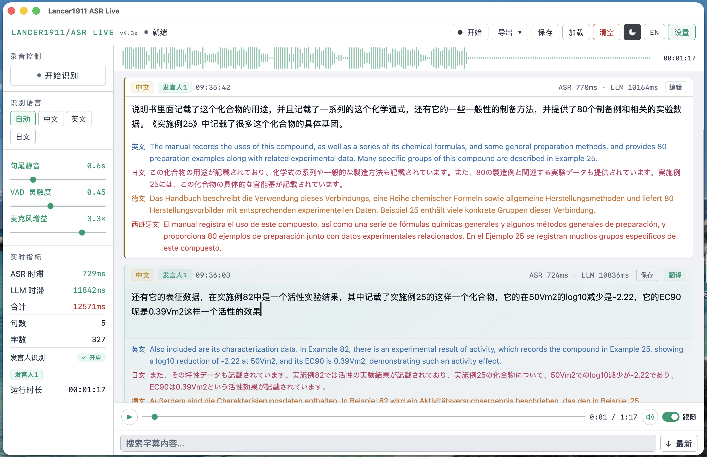
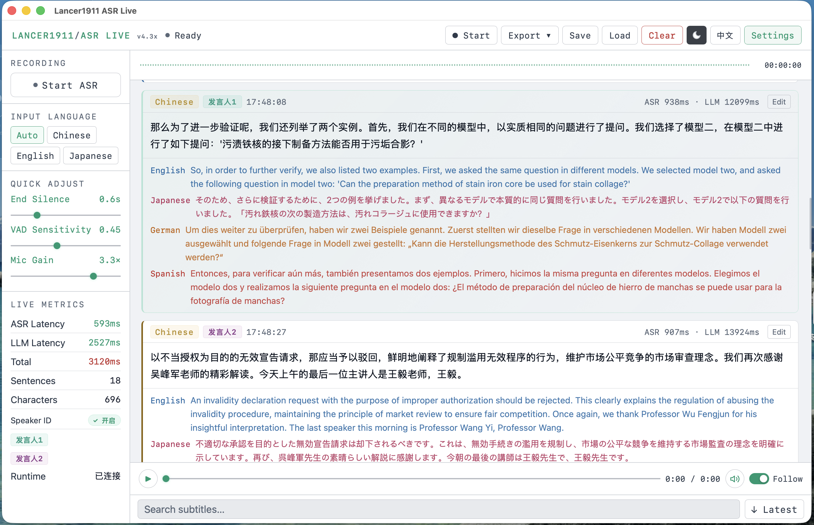
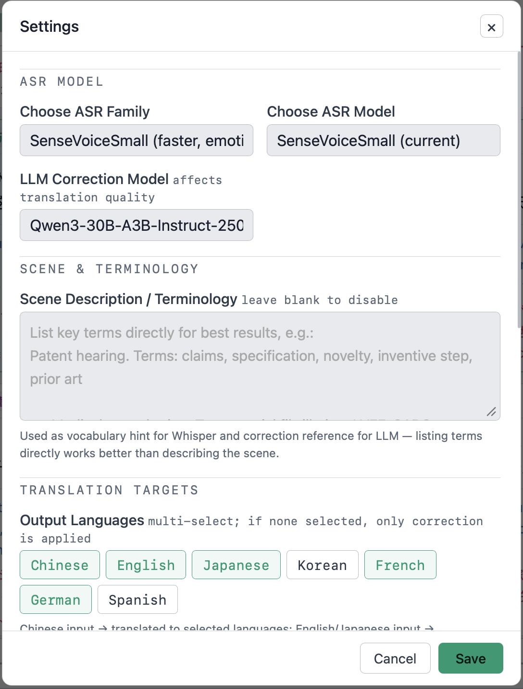
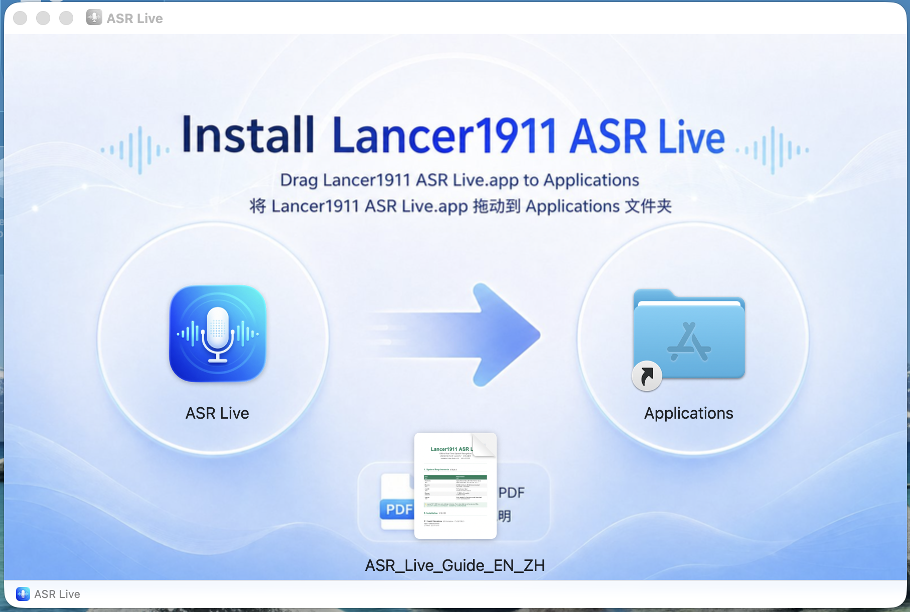

> 🌐 [中文说明](README-ZH.md)

# Lancer1911 ASR Live

> Fully offline real-time multilingual speech recognition + LLM semantic correction + multilingual translation  
> Built exclusively for Apple Silicon — requires an M-series Mac with 24 GB RAM or more


---

## ⚠️ Hardware Requirements

Lancer1911 ASR Live runs up to three large AI models simultaneously — a Whisper ASR model, a Qwen3 LLM, and optionally a pyannote speaker embedding model — entirely on-device. **This is not optional software that degrades gracefully on lower-spec hardware.** All active models must fit in unified memory at the same time.

| | Minimum | Recommended |
|---|---|---|
| **Chip** | Apple M1 | M2 Pro / M3 / M4 or later |
| **Unified Memory** | **24 GB** | **48 GB** |
| **Storage** | 15 GB free | 30 GB free (+ 0.5 GB for speaker models) |
| **macOS** | 13 Ventura | 14 Sonoma or later |

> **Why 24 GB?** The default configuration (whisper-large-v3-turbo ≈ 3 GB + Qwen3-14B-4bit ≈ 8 GB + pyannote speaker models ≈ 0.5 GB) consumes roughly 12–14 GB for the models alone. macOS, the UI, and working buffers need the rest. On 16 GB machines the system will thrash or crash under load. If you only have 16 GB, use a smaller LLM such as Qwen3-8B-4bit and accept reduced translation quality. The pyannote speaker model is optional and can be omitted to save memory.

---

## Screenshots

<p align="center">
  
  <br><em>Main interface — real-time transcription with multilingual translations (Chinese UI)</em>
</p>

<p align="center">
  
  <br><em>Main interface — English UI</em>
</p>

<p align="center">
  
  <br><em>Settings panel — model selection, scenario prompts, and audio configuration</em>
</p>

<p align="center">
  
  <br><em>Playback bar — replay recordings with transcript scrolling in sync</em>
</p>

<p align="center">
  
  <br><em>Installation in macOS</em>
</p>

---

## Features

- **Fully offline** — Recognition, correction, and translation run entirely locally. No audio or text ever leaves your machine.
- **Native .app** — Ships as a double-click macOS application; no terminal required after initial setup.
- **Dual ASR backends** — Choose between **Whisper** (high accuracy, 99 languages) and **SenseVoice** (3–5× faster, emotion/event detection, Chinese/English/Japanese/Korean). Both can be installed side-by-side and switched in Settings.
- **Real-time subtitles** — Voice Activity Detection (VAD)-triggered sentence segmentation delivers results in approximately 0.5–2 seconds end-to-end.
- **Three-language auto-detection** — Recognises Chinese, English, and Japanese in real time, with optional translation into Korean, French, German, and Spanish.
- **ASR language lock** — Pin the ASR engine to a specific language (Auto / Chinese / English / Japanese) to prevent mis-detection in monolingual sessions.
- **LLM semantic correction** — Qwen3 fixes homophones, punctuation, and domain terminology using recent conversational context.
- **Scenario and terminology prompts** — A free-text field is injected into both Whisper's `initial_prompt` and the LLM system prompt. List key terms directly for best results (see Settings section).
- **ModelScope / plain-directory model support** — Models downloaded via ModelScope or placed directly in the cache root (non-`snapshots/` layout) are detected and loaded automatically. No path configuration needed.
- **Segmented MP3 recording** — Audio is written in 5-minute segments during the session and merged into a single timestamped MP3 on stop. Pause and resume without losing audio.
- **Microphone software gain** — Boost the captured signal up to 4× directly in the app when macOS restricts the hardware mic level.
- **Subtitle playback sync** — An inline audio player lets you replay the recording while the transcript scrolls in lock-step with the audio position.
- **Search and highlight** — Filter the live transcript by keyword with real-time highlighting.
- **Dark / light themes** — One-click toggle, persisted across sessions.
- **Multi-format export** — TXT, SRT, JSON, and Markdown, with per-language filtering and a native macOS save panel.
- **Built-in model downloader** — First-run wizard detects missing models and streams download progress directly in the UI.
- **Hallucination filtering** — ASR outputs with more than 50% repeated tokens are automatically discarded.
- **Speaker diarization** — Automatically identifies up to 4 speakers using pyannote-audio voice embeddings. Each subtitle card is labelled with a colour-coded speaker badge. Speakers can be renamed and manually corrected. Speaker labels are included in all export formats.

---

## Quick Start

### 1. Clone the repository

```bash
git clone https://github.com/lancer1911/ASR-Live.git
cd ASR-Live
```

### 2. Install system dependencies

```bash
# Required for MP3 encoding
brew install ffmpeg
```

### 3. Create the runtime environment

```bash
python3 -m venv ~/asr-env
source ~/asr-env/bin/activate
pip install -r requirements.txt
pip install onnxruntime pywebview
```

### 4. Download models

**Option A — Whisper (default, 99 languages)**

```bash
# Recommended — fast turbo model (~3 GB)
hf download mlx-community/whisper-large-v3-turbo

# Alternative — highest accuracy, slower (~3 GB)
# hf download mlx-community/whisper-large-v3-mlx
```

**Option B — SenseVoice (faster, Chinese/English/Japanese/Korean)**

```bash
pip install mlx-audio
hf download mlx-community/SenseVoiceSmall
```

> Both backends can be installed side-by-side. Switch between them in **Settings → Select ASR Family**.

**LLM for correction and translation**

```bash
# Default (~8 GB)
hf download mlx-community/Qwen3-14B-4bit

# High-quality alternative — requires ≥48 GB unified memory (~16 GB)
# hf download mlx-community/Qwen3-30B-A3B-Instruct-2507-4bit
```

> Models are cached in `~/.cache/huggingface/hub/` and work offline once downloaded. You can also download them through the built-in guide after first launch.

> **ModelScope users:** models downloaded via ModelScope are detected automatically. No path configuration needed.

### 5. Speaker Diarization Models (Optional)

When installed, the app automatically identifies up to 4 speakers and labels each subtitle card.

**Step 1 — Create a HuggingFace Read token**

Go to [huggingface.co/settings/tokens](https://huggingface.co/settings/tokens) and create a token of type **Read** (not fine-grained).

**Step 2 — Accept model agreements**

While logged in, visit each page and click "Agree and access repository":

- [pyannote/embedding](https://huggingface.co/pyannote/embedding)
- [pyannote/segmentation-3.0](https://huggingface.co/pyannote/segmentation-3.0)

**Step 3 — Login and download**

```bash
source ~/asr-env/bin/activate
pip install pyannote.audio torch omegaconf
hf auth login   # paste your Read token when prompted
hf download pyannote/embedding
hf download pyannote/segmentation-3.0
```

After installation the app detects the models automatically at startup. The sidebar will show **Speaker ID: On** when active. Use **Settings → Check Speaker ID Setup** for an in-app guided walkthrough.

### 6. Launch

```bash
source ~/asr-env/bin/activate
cd ASR-Live
python main.py
```

A native window opens automatically. First startup takes approximately 30–60 seconds while both models load into memory. Click **Start** once the status bar shows "Ready".

---

## Packaging as a .app

```bash
# 1. Install Python 3.11 for packaging (separate from the runtime)
brew install pyenv
pyenv install 3.11.9

# 2. Create a dedicated build environment (one-time)
cd ASR-Live
~/.pyenv/versions/3.11.9/bin/python -m venv venv_build
source venv_build/bin/activate
pip install py2app

# 3. Build
rm -rf build dist
python build_mac.py py2app

# 4. Install
open dist/
# Drag "Lancer1911 ASR Live.app" to /Applications
```

The `.app` bundle is approximately 15 MB and does not embed MLX, PyTorch, or any AI models. All large dependencies stay in `~/asr-env`.

**First-launch Gatekeeper warning:**

```bash
xattr -cr "/Applications/Lancer1911 ASR Live.app"
```

Or right-click → Open → click "Open" in the dialog.

---

## Creating a DMG for Distribution

Requires [create-dmg](https://github.com/create-dmg/create-dmg): `brew install create-dmg`

>Prepare `~/Desktop/ASR_Live_DMG_src/` containing the built `.app` and the guide PDF, then run:

```bash
create-dmg \
  --volname "Lancer1911 ASR Live" \
  --volicon ~/Playground/asr_app_v4_0/icon.icns \
  --background ~/Desktop/ASR_Live_DMG_src/dmg_background_900x556.png \
  --window-pos 200 120 \
  --window-size 900 605 \
  --icon-size 120 \
  --icon "Lancer1911 ASR Live.app" 213 299 \
  --icon "Lancer1911_ASR_Live_Guide_EN_ZH.pdf" 450 451 \
  --hide-extension "Lancer1911 ASR Live.app" \
  --app-drop-link 683 299 \
  --disk-image-size 300 \
  ~/Desktop/ASR_Live_DMG_src/"Lancer1911 ASR Live.dmg" \
  ~/Desktop/ASR_Live_DMG_src/
```

The finished `Lancer1911 ASR Live.dmg` will be in `~/Desktop/ASR_Live_DMG_src/`.

---

## Settings

### ASR backend

Select **Whisper** or **SenseVoice** under **Select ASR Family**. The model dropdown updates to show only locally cached models of the selected type. Switching takes effect on the next Start (or immediately when not recording).

| Backend | Speed | Languages | Notes |
|---|---|---|---|
| Whisper large-v3-turbo | ~1–2 s/sentence | 99 | Default; best for multilingual sessions |
| SenseVoice Small | ~0.3–0.5 s/sentence | zh/en/ja/ko/yue | Requires `mlx-audio`; no `initial_prompt` support |

### LLM correction model

Automatically lists locally cached MLX-format LLMs — Qwen3, LLaMA, Gemma, Mistral, and others.

### Scenario and terminology

Enter domain background and vocabulary for the current session. The same text is applied simultaneously to both models:

- **Whisper `initial_prompt`** — Biases acoustic decoding toward listed terms. (Not applicable to SenseVoice.)
- **LLM system prompt** — Guides semantic correction toward the correct spelling of domain terms.

**Listing key terms directly produces better results than describing the scene in prose:**

```text
# Good
Patent hearing. Terms: claims, specification, novelty, inventive step, prior art, dependent claims

# Good
Medical consultation. Terms: atrial fibrillation, LVEF, CABG, ejection fraction, sinus rhythm

# Less effective
This is a meeting about patents and medical topics.
```

### ASR language lock

Select **Auto** to let the ASR engine detect the language on each sentence, or pin to **Chinese / English / Japanese** for monolingual sessions. The lock cannot be changed while recording is active.

### Translation targets

Choose which languages to display as translations. The language currently being spoken is automatically excluded from translation output to avoid duplication.

### Speaker diarization

Requires the optional pyannote models (see Quick Start §5). When active the sidebar shows a colour-coded list of detected speakers.

| Parameter | Default | Range | Notes |
|---|---|---|---|
| Voice match threshold | 0.68 | 0.60–0.98 | Cosine similarity required to match an existing speaker. Lower = more lenient. |
| New speaker confirm sentences | 2 | 1–4 | Frames accumulated before registering a new speaker. Higher = fewer false registrations. |
| Speaker warmup | 20 s | — | Voice audio accumulated before speaker labels are output; prevents early mis-identification. |

Click a speaker badge on any subtitle card to reassign it to a different speaker. Click a speaker label in the sidebar to rename it — all cards update immediately.

### Audio input

| Parameter | Default | Range | Notes |
|---|---|---|---|
| Microphone gain | 1.5× | 1.0–4.0× | Software boost applied before Voice Activity Detection (VAD) and ASR |
| End-of-sentence silence | 0.8 s | 0.2–2.0 s | Pause duration that triggers sentence segmentation |
| VAD sensitivity | 0.40 | 0.20–0.80 | Higher = less sensitive; increase to 0.6–0.7 in noisy environments |
| Maximum utterance length | 20 s | — | Forces segmentation if a sentence exceeds this duration |
| Save recording | Enabled | — | Disable for transcription-only mode with no files written |
| MP3 bitrate | 192 kbps | 64 / 128 / 192 / 320 | Applied to the merged final file |
| Microphone device | System default | — | Supports AirPods, USB mics; click ↻ to rescan |

---

## Recording

- Audio is buffered in 5-minute segments during the session to bound memory usage.
- **Pause** temporarily stops the microphone stream while keeping the current session open. **Resume** appends to the same MP3.
- After **Stop**, segments are merged in the background into a single file: `ASRLive_YYYYMMDD_HHMMSS.mp3`, saved to `~/Downloads` by default. A native save panel appears in windowed mode.
- The **playback bar** appears automatically once the file is ready. It supports play/pause, scrubbing, volume control, and a "follow playback" mode that scrolls the transcript in sync.
- Each transcript entry stores its precise start offset in the MP3. Clicking an entry in follow mode jumps the player to that sentence.
- On exit, the application waits up to 10 seconds for any pending encoding to finish before quitting.

---

## Export

Click **Export ▾** in the top bar, choose a language filter and format, then save via the native panel.

| Format | Description |
|---|---|
| TXT | Plain text with a timestamp per entry |
| SRT | Standard subtitle format, importable into video editors |
| JSON | Full detail: timestamps, latency, raw ASR, corrected text, all translations |
| Markdown | Suitable for Obsidian, Notion, or any Markdown-based tool |

Speaker labels (names or default "发言人N") are included in all export formats — TXT, SRT, JSON, and Markdown.

**Language filter options:** all languages mixed · corrected original only · raw ASR only · any single language (includes entries where that language appears as either the original or a translation).

For long sessions, transcript history beyond the most recent 200 entries is streamed to a JSONL file in `~/Downloads` and automatically included in exports.

---

## FAQ

**The window shows "Connecting" for a long time after launch.**  
The first load takes 30–60 seconds while both models are read into unified memory. Wait until the status bar shows "Ready" before interacting.

**`Address already in use` on startup.**  
`main.py` automatically kills any process holding port 17433 on launch. If the problem persists: `lsof -ti :17433 | xargs kill -9`

**Microphone permission error: `PortAudioError -9986`.**  
System Settings → Privacy & Security → Microphone → grant permission to Terminal or Lancer1911 ASR Live.app.

**Repeated hallucinations like "nope nope nope…".**  
The app filters these automatically. If they persist, raise VAD sensitivity to 0.6–0.7 and ensure the silence threshold is at least 0.5 s.

**No translation output.**  
Confirm that translation target languages are selected and saved in Settings. If the issue persists, delete `~/.asrlive_settings.json` and restart.

**LLM latency is too high (>3 s).**  
Switch to a smaller model (Qwen3-8B-4bit) or reduce the number of translation targets. Each additional target language adds one JSON field for the LLM to generate.

**Recording was not saved.**  
Confirm ffmpeg is installed (`brew install ffmpeg`) and that "Save recording" is enabled in Settings.

**`No module named 'onnxruntime'`.**  
`pip install onnxruntime`

**`No module named 'mlx_audio'` when using SenseVoice.**  
`pip install mlx-audio`

**Speaker ID shows "Not installed" in the sidebar.**  
Follow Quick Start §5. If packages are installed but the model is missing, run `hf download pyannote/embedding && hf download pyannote/segmentation-3.0`. Use **Settings → Check Speaker ID Setup** for an in-app walkthrough.

**A model downloaded via ModelScope is not detected.**  
Ensure the weight files (`.safetensors` / `.bin` / `.npz`) are present under `~/.cache/huggingface/hub/models--<org>--<name>/`. The app scans for root-level weight files automatically on each launch — no path configuration is needed.

**Model downloads are slow or fail.**  
Use the Hugging Face mirror: `export HF_ENDPOINT=https://hf-mirror.com`

---

## Dependencies

| Project | Purpose |
|---|---|
| [mlx-whisper](https://github.com/ml-explore/mlx-examples) | Native Whisper inference on Apple Silicon via MLX |
| [mlx-lm](https://github.com/ml-explore/mlx-examples) | Native LLM inference on Apple Silicon via MLX |
| [mlx-audio](https://github.com/Blaizzy/mlx-audio) | SenseVoice inference on Apple Silicon via MLX |
| [Silero VAD](https://github.com/snakers4/silero-vad) | Voice activity detection |
| [FastAPI](https://fastapi.tiangolo.com) | Backend API and WebSocket server |
| [pywebview](https://pywebview.flowrl.com) | Native macOS window (WKWebView) |
| [sounddevice](https://python-sounddevice.readthedocs.io) | Microphone capture via PortAudio |
| [ffmpeg](https://ffmpeg.org) | MP3 encoding for recordings |
| [Qwen3](https://huggingface.co/Qwen) | LLM for semantic correction and translation |
| [Whisper large-v3-turbo](https://huggingface.co/openai/whisper-large-v3-turbo) | Default ASR model |
| [SenseVoiceSmall](https://huggingface.co/FunAudioLLM/SenseVoiceSmall) | Optional fast ASR model |
| [pyannote-audio](https://github.com/pyannote/pyannote-audio) | Speaker diarization via voice embeddings |
| [PyTorch](https://pytorch.org) | Required by pyannote-audio |

---

## License

MIT
